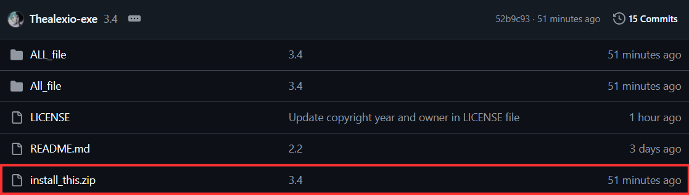
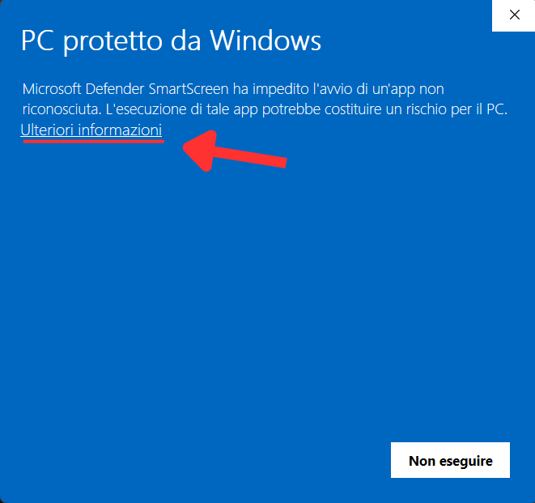
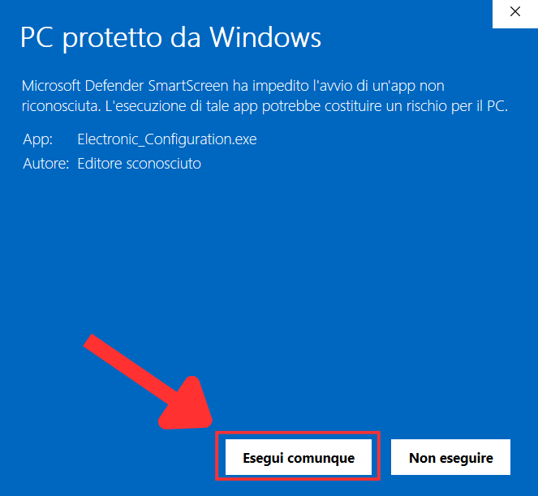
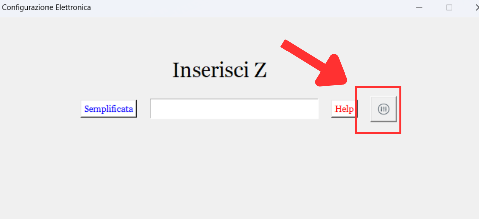

# Electronic configuration

##  **English**

**Introduction**:
This program is a small electronic configuration converter (this is my first official project published on GitHub).

The program was developed in Python using the Tkinter library and includes several features, including:

- Simplified or full mode
- IT / EN language switching
- Automatic preference saving

Results are generated instantly and the program also handles some exceptions in electronic configuration.

---

**Download**: To install this program correctly, follow the instructions shown below -->

- #### Download the compressed folder `install_this`, then extract it completely.  
  **Important:** do not move the `.exe` file outside the extracted folder, otherwise the program may not work correctly.

    

- #### At first startup Windows may display a SmartScreen warning. This is normal because the executable file is not digitally signed.

  The program does not collect data and does not require an Internet connection. Follow the instructions shown in the images:

    
    &nbsp;&nbsp;&nbsp;&nbsp;
    

- #### To change language simply click the settings button.

  The default language is Italian and the program automatically saves your preferences.

    

---

**Contacts**: For questions, bug reports or suggestions: `alessioargenti10@gmail.com`

##  **Italiano**

**Introduzione**:  
Questo programma è un piccolo convertitore per la configurazione elettronica (è il mio primo progetto ufficiale pubblicato su GitHub).

Il programma è stato sviluppato in Python utilizzando la libreria Tkinter e include diverse funzionalità, tra cui:

- Modalità semplificata o completa
- Cambio lingua IT / EN
- Salvataggio automatico delle preferenze

I risultati vengono generati istantaneamente e il programma gestisce anche alcune eccezioni della configurazione elettronica.

---

**Download**: Per installare correttamente questo programma segui le istruzioni illustrate qui sotto -->

- #### Scarica la cartella compressa `install_this`, quindi estraila completamente.  
  **Importante:** non spostare il file `.exe` fuori dalla cartella estratta, altrimenti il programma potrebbe non funzionare correttamente.

    

- #### Al primo avvio Windows potrebbe mostrare un avviso SmartScreen  questo è normale perché il file eseguibile non è firmato digitalmente.
  Il programma non raccoglie dati e non richiede connessione a Internet, Segui le istruzioni mostrate nelle immagini:

    
    &nbsp;&nbsp;&nbsp;&nbsp;
    

- #### Per cambiare lingua basta cliccare sul pulsante impostazioni.

  La lingua iniziale è impostata in italiano e il programma salva automaticamente le preferenze.

    

---

**Contatti**: In caso di domande, bug o suggerimenti: `alessioargenti10@gmail.com`